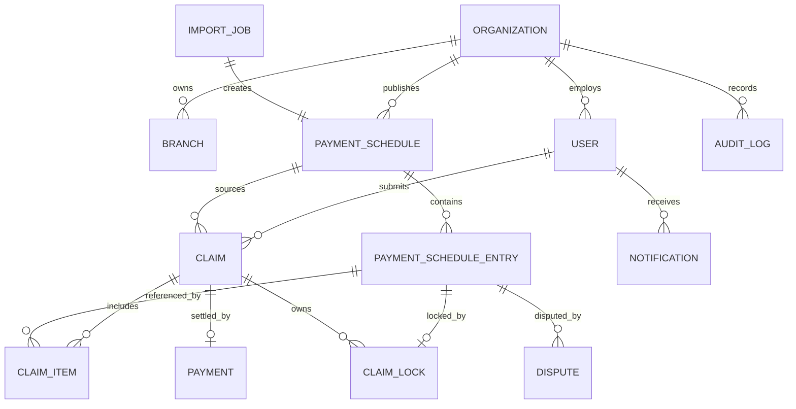

# ASASU Commission OS Architecture

## Product boundary

The platform replaces the Excel hand-off between ASASU operations, partners, verification, and finance. A published payment-schedule row is the source of truth. Agents claim that immutable row directly; they do not upload or recalculate a second workbook.

The local application uses the repository JSON adapter so the complete workflow can be demonstrated immediately. The production schema in `apps/api/prisma/schema.prisma` is the PostgreSQL target and is designed for multiple organizations, branches, and commission programs.

## Workbook findings

Three supplied workbooks were inspected and rendered:

| Workbook | Shape | Important finding |
| --- | --- | --- |
| `ASASU ABUJA 20th.xlsx` | Header row 3, 205 clients + total | Account numbers have leading zeroes and must be stored as text. |
| `ASASU_YOLA 20thRSA.xlsx` | Header row 4, 34 clients + total | `TOTAL` is in the client-name column, so total-row detection cannot depend on column A. |
| `1784573784227-ASASU EXCEL.xlsx` | Legacy claim template | `EQUITY × 1% = commission`; bank details and schedule references are free text. |

The schedule formulas establish the business rule:

- `3% SERV.CHG = RSA AMOUNT × 0.03`
- `0.1% A/MT = RSA AMOUNT × 0.001`
- `NET = RSA AMOUNT - 3% SERV.CHG - 0.1% A/MT - ACCT.BAL`
- normal-agent commission = `RSA AMOUNT × 0.01`
- sub-developer commission = `RSA AMOUNT × 0.015` or `RSA AMOUNT × 0.02`

The previous prototype incorrectly multiplied the already-derived 1% service charge by another 1%. Commission is now calculated from RSA/equity and the server-owned rate.

## Core workflow

```mermaid
flowchart LR
  A["Admin uploads workbook"] --> B["Header and column detection"]
  B --> C["Validation preview"]
  C --> D["Publish schedule"]
  D --> E["Notify all active agents"]
  E --> F["Agent searches schedule"]
  F --> G["Selects immutable rows"]
  G --> H["Atomic claim + row locks"]
  H --> I["Operations verifies"]
  I --> J["Finance marks paid"]
  H --> K["Ownership dispute"]
  K --> I
```

## Import pipeline

1. Store the source file and checksum.
2. Inspect every worksheet and locate a header row by semantic column aliases.
3. Preserve account/application numbers as strings.
4. Read cached formula results but recompute trusted commission values server-side.
5. Infer branch and payment date from heading rows and worksheet names.
6. Remove blank rows and total rows, including totals outside the first column.
7. Validate missing RSA amounts, duplicate account/application numbers, and duplicate schedule fingerprints.
8. Present the detected mapping and warnings before publication.
9. Persist the schedule and entries in one transaction, then enqueue notifications.

Legacy claim workbooks are supported only as a migration preview. They are not part of the new claim path.

## Duplicate protection

The API validates schedule row ownership and creates the claim inside one serialized mutation. The PostgreSQL design adds a stronger database guarantee: `ClaimLock.scheduleEntryId` is the primary key, so only one active lock can exist for any payment-schedule row.

Rejected or transferred items release their lock inside the same serializable transaction. Historical `ClaimItem` records remain intact for audit purposes.

## Data model

Key production indexes cover organization/branch scope, schedule date/status, normalized client name, account number, application number, claim status, dispute status, unread notifications, and audit entity/actor timelines.

## Authorization

| Role | Principal abilities |
| --- | --- |
| Super Admin / Admin | Full organization configuration and workflow control |
| Operations | Publish schedules, verify claims, resolve disputes |
| Finance | Read approved claims, mark paid, export settlement ledger |
| Auditor | Read schedules, claims, payments, and audit trail |
| Support | Read and manage support/dispute conversations |
| Branch Admin | Branch-scoped schedule and claim operations |
| Agent | Fixed 1% claims, messages, disputes, payment history |
| Sub Developer | Selectable 1.5% or 2% claims, messages, disputes, payment history |

All claim rates, amounts, transitions, and payment references are recalculated or generated on the server. Browser inputs are never trusted for payout values.

## Scale path

- PostgreSQL with cursor pagination and indexed server-side search.
- Redis for rate limits, session revocation, hot schedule metadata, and distributed locks around publication jobs.
- Queue workers for parsing, email/SMS/WhatsApp delivery, anomaly scoring, reports, and payment-provider callbacks.
- Object storage for source workbooks and dispute evidence, with malware scanning and signed URLs.
- Read replicas/materialized views for operational analytics and financial reporting.
- Outbox events for reliable integrations with accounting, banking, PFA, WhatsApp, mobile, and public APIs.
- Tenant and branch filters enforced in repository queries and PostgreSQL row-level security where appropriate.

## Security baseline

- Short-lived JWT access tokens, refresh-token rotation, MFA-ready identity boundary.
- Explicit role and branch authorization on every mutation.
- Database-level claim locks and idempotency keys for schedule publication and payment callbacks.
- Content-type/size validation, checksum duplicate detection, malware scanning, and private object storage.
- Append-only audit events containing actor, before/after state, IP, user agent, and timestamp.
- Encryption in transit and at rest, secret-manager configuration, rate limiting, Helmet headers, and strict CORS.
- Finance mutations require approved claim state and should use step-up authentication in production.
